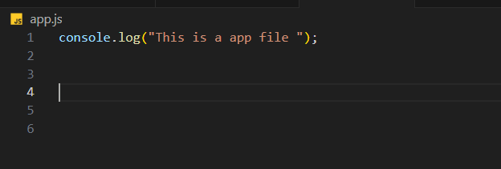
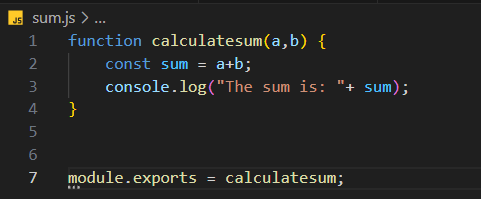

# Here We Go NodeJS

+ For executing js file in terminal use ->```node app.js[file_name]```

##  REQUIRE & EXPORT MODULE:
+ For accessing modules from another file we can use ```require("./filename.js")```
    - First file which we want to execute 
    - Second filed part which we want to execute in first file
    - Successfully Achieved Output using ```require("./filename")```
    
        
  
    * for accessing function / variables from another module
        1.  we have to first export function from parent file
        
        2. Then we need to import exported module in required file
        
    * And now we'll get output 
    

## COMMON JS MODULES(CJS):


